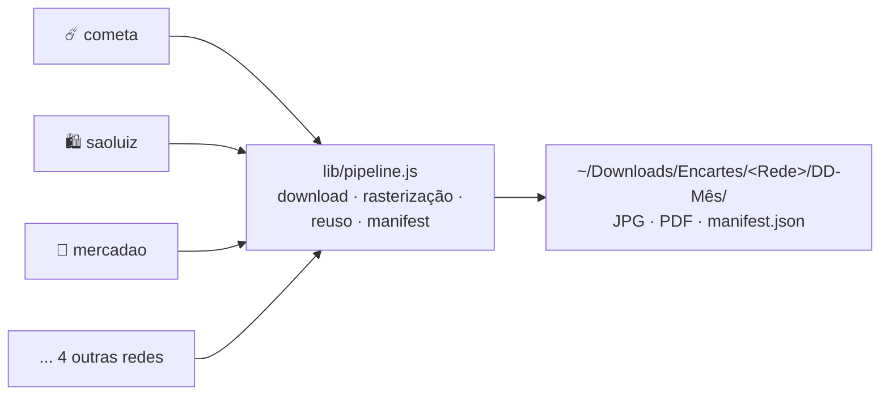

# 🛒 Promoções de Supermercados de Fortaleza

[](./LICENSE)
[](https://nodejs.org)
[](../../actions)

Skills para agentes de código (Claude Code, Codex e Pi) baixarem os encartes
vigentes dos supermercados de Fortaleza em alta resolução, organizados por
mercado e data, prontos para o agente ler as páginas e comparar ofertas.

## Mercados

| Skill | Mercado | Como baixa | Requer | Flags extras |
|---|---|---|---|---|
| ☄️ [`cometa-encartes`](./cometa-encartes) | Supermercado Cometa | API do site, PDF rasterizado | poppler | `--dpi` |
| 🛍️ [`saoluiz-encartes`](./saoluiz-encartes) | Mercadinhos São Luiz | Playwright, imagens prontas | `npm install` | |
| 💰 [`superdopovo-encartes`](./superdopovo-encartes) | Super do Povo | Playwright, PDF ou imagens | poppler + `npm install` | `--dpi` `--all` |
| 🧺 [`mercadao-encartes`](./mercadao-encartes) | Mercadão São Luiz | HTML do site, imagens originais | nada | `--dry-run` |
| 🐂 [`atacadao-encartes`](./atacadao-encartes) | Atacadão | HTML do site, PDF rasterizado | poppler | `--dpi` `--loja` |
| 🏪 [`guara-encartes`](./guara-encartes) | Supermercado Guará | Playwright, imagens prontas | `npm install` | |
| 🚀 [`todos-encartes`](./todos-encartes) | Todos os mercados de uma vez | dispara as skills acima | conforme cada rede | `--dpi` `--all` |

Todas aceitam `--base`, `--only-newest` e `--sem-reuso`. O Mercadão não tem
`--only-newest` (baixa tudo que encontrar) e o Atacadão usa a loja
`fortaleza-aeroporto` por padrão.

## Instalar

```bash
git clone https://github.com/mouraod/promocoes-supermercados-fortaleza.git ~/Developer/promocoes-supermercados-fortaleza
cd ~/Developer/promocoes-supermercados-fortaleza

# symlink das 7 skills para o seu agente (exemplo com Claude Code)
for s in cometa-encartes saoluiz-encartes superdopovo-encartes mercadao-encartes atacadao-encartes guara-encartes todos-encartes; do
  ln -sfn "$(pwd)/$s" ~/.claude/skills/$s
done

# dependências das skills que usam Playwright
for s in saoluiz-encartes superdopovo-encartes guara-encartes; do (cd $s && npm install); done
```

Ajuste o destino dos symlinks para o seu agente: `~/.codex/skills` (Codex),
`~/.pi/agent/skills` (Pi) ou `~/.claude/skills` (Claude Code). Poppler via
`brew install poppler` (macOS) quando a skill rasteriza PDF. Node 18 ou
superior (fetch nativo).

## Como usar

Peça ao agente: "baixar encartes do Cometa", "baixar encartes São Luiz",
"baixar todos os encartes", ou cole um link de encarte. A saída fica
organizada por mercado e data, com um manifest por rodada:

```
~/Downloads/Encartes/
└── Cometa/
    └── 17-Agosto/
        ├── PDF/
        │   └── 12-encarte-de-agosto.pdf
        ├── JPG/
        │   ├── 12-encarte-de-agosto-pagina-01.jpg
        │   └── 12-encarte-de-agosto-pagina-02.jpg
        └── manifest.json
```

A leitura das ofertas é visual, feita pelo próprio agente; nenhum script
interpreta imagem. O script é só o download. Comparar com a sua lista de
compras, montar a lista da semana e decidir o que vale a pena é conversa com
o agente.

Rodadas repetidas na mesma semana são rápidas: páginas de encartes que já
existem em rodadas anteriores são reaproveitadas por hardlink.

## Por dentro

Cada skill de mercado é só um adapter de descoberta (80 a 120 linhas) que
sabe falar com o site daquela rede. Todo o resto vive em um pipeline
compartilhado:



- `lib/pipeline.js` baixa com timeout e limite de tamanho, rasteriza PDF com
  poppler, reaproveita páginas entre rodadas e grava o manifest
- `lib/redes.js` registra script, flags e dependências de cada rede
- mercado novo = adapter `descobrir()` + entrada no registry, sem tocar no
  resto
- `node --test` roda os 18 testes sem rede e sem poppler

## Licença

[MIT](./LICENSE)
